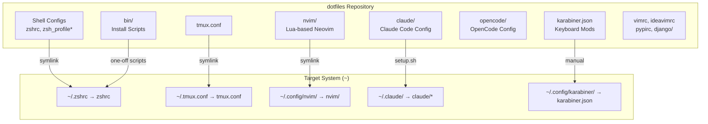
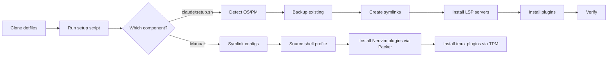

# Architecture

## 1. System Overview

A personal dotfiles repository that manages development environment configuration across macOS and Linux. It provides reproducible setup for shell (Zsh), editor (Neovim), terminal multiplexer (tmux), keyboard customization (Karabiner), and AI coding assistants (Claude Code, OpenCode). The core value proposition is **one-command environment replication** — clone the repo and run a setup script to get a fully configured development workstation.

## 2. High-Level Architecture

## 3. Technology Stack

| Layer | Technology | Notes |
|-------|-----------|-------|
| Shell | Zsh + Oh-My-Zsh | Theme: bira, plugins: git, syntax-highlighting, autosuggestions, fzf |
| Editor | Neovim (Lua config) | Packer plugin manager, Mason LSP, Treesitter, Telescope |
| Legacy Editor | Vim (vimrc) | ~28KB vimrc, kept for compatibility |
| Terminal Mux | tmux | TPM plugin manager, vim-tmux-navigator integration |
| AI - Claude | Claude Code CLI | oh-my-claudecode, everything-claude-code, context7, 11 plugins |
| AI - OpenCode | OpenCode | Separate config with MCP tools, agent skills |
| Keyboard | Karabiner-Elements | ESC → English input switch |
| IDE | JetBrains (IdeaVim) | ideavimrc for Vim emulation |
| Package Mgr | Homebrew (macOS), apt/dnf/yum (Linux) | Detected automatically by setup scripts |
| Languages | Bash, Lua, Python (tooling), JSON/YAML (config) | |

## 4. Component Deep Dives

### Shell (`zshrc`, `zsh_profile`, `zsh_profile.m1`)

- **Responsibility**: Shell environment, PATH, aliases, prompt
- **Key files**:
  - `zshrc` — Oh-My-Zsh bootstrap, plugin list, SDKMAN/fzf init
  - `zsh_profile` — Intel Mac profile (pyenv, nvm, Go, aliases)
  - `zsh_profile.m1` — Apple Silicon profile (Homebrew at `/opt/homebrew`)
  - `zsh_profile.window` — WSL-specific overrides
- **Pattern**: `zshrc` sources `~/.zsh_profile` + `~/.zsh_profile.custom` for layered config

### Neovim (`nvim/`)

- **Responsibility**: Full IDE-like editor experience
- **Key files**:
  - `nvim/init.lua` — Module loader (ordered: compat → plugins → options → LSP → UI)
  - `nvim/lua/user/plugins.lua` — Packer plugin declarations (~60 plugins)
  - `nvim/lua/user/lsp/` — Mason + LSP config (pyright, lua_ls, jsonls, kotlin)
  - `nvim/lua/user/dap/` — Debug Adapter Protocol (Python, Kotlin)
  - `nvim/lua/user/keymaps.lua` — Key bindings
- **Plugin categories**: Files/Search (fzf, telescope), Editing (autopairs, surround, comment), Git (fugitive, gitsigns, diffview), Completion (nvim-cmp), Treesitter, LSP (Mason)

### Claude Code (`claude/`)

- **Responsibility**: AI assistant configuration, symlinked to `~/.claude/`
- **Key files**:
  - `claude/setup.sh` — Automated installer (symlinks + LSP + plugins)
  - `claude/settings.json` — Permissions, hooks, plugin registry, status line
  - `claude/commands/` — Slash commands (plan, review, explain, fix-ci, techdebt, harness)
  - `claude/agents/` — Custom agents (code-reviewer, debugger, planner)
  - `claude/rules/` — Coding rules (style, git, testing, security, performance, patterns, hooks, agents)
- **Hooks**: PreToolUse (dev server tmux warning), PostToolUse (console.log detection, agent completion notification)

### Install Scripts (`bin/`)

- **Responsibility**: One-off tool installation
- **Key files**: `install-*.sh` for nvm, pyenv, tmux, zsh, fonts, fzf, rbenv, sdkman, nvim, vimplug
- **Subfolders**: `bin/fzf/`, `bin/rbenv/`, `bin/git/`, `bin/init-mac/`
- **Pattern**: Each script is self-contained, idempotent where possible

### OpenCode (`opencode/`)

- **Responsibility**: Alternative AI coding assistant config
- **Key files**: `opencode/MODES.md`, `opencode/OPTIMIZATION.md`, `opencode/commands/`, `opencode/rules/`

## 5. Data Flow

**Shell startup flow**: `zshrc` → Oh-My-Zsh init → plugins → `~/.zsh_profile` → `~/.zsh_profile.custom` → SDKMAN → fzf

**Neovim startup flow**: `init.lua` → compat check → Packer plugins → options → keymaps → autocommands → LSP/cmp → Telescope/fzf → UI modules → WhichKey

## 6. Data Model

No persistent data model. This project manages **configuration as code**:

| Entity | Storage | Format |
|--------|---------|--------|
| Shell config | Flat files | Bash/Zsh scripts |
| Neovim config | Lua modules | Lua (`nvim/lua/user/*.lua`) |
| Claude config | JSON + Markdown | `settings.json`, `commands/*.md`, `rules/*.md` |
| Keybindings | JSON | `karabiner.json`, `complex_modifications/` |
| tmux config | Flat file | tmux native format |
| Plugin state | External (Packer, TPM) | Managed by respective plugin managers |

## 7. External Interfaces

| Interface | Direction | Details |
|-----------|-----------|---------|
| GitHub (plugins) | Outbound | Packer (Neovim), TPM (tmux), Claude plugins |
| npm registry | Outbound | LSP server installation (typescript-language-server, etc.) |
| Homebrew | Outbound | macOS package installation |
| Claude Code CLI | Bidirectional | Plugin management, slash commands |
| MCP Servers | Outbound | context7 (docs), serena (code analysis), oh-my-claudecode (LSP/AST) |
| Karabiner-Elements | Local | Keyboard modification daemon |
| SDKMAN | Outbound | JVM toolchain management |
| pyenv/nvm/rbenv | Outbound | Language version management |

## 8. Infrastructure & Deployment

- **Deployment model**: `git clone` + manual symlinks or `claude/setup.sh`
- **No CI/CD**: Personal dotfiles; manual testing on target machines
- **Supported platforms**: macOS (Intel + Apple Silicon), Linux (Ubuntu/Fedora/CentOS), WSL
- **Backup strategy**: `setup.sh --force` creates timestamped backups before overwriting
- **Verification**: `setup.sh` includes `verify_installation()` checking symlink integrity and circular link detection

## 9. Security Model

| Concern | Approach |
|---------|----------|
| Secrets exclusion | `claude.json` excluded from symlinks (contains OAuth/userID) |
| Git exclusion | `.gitignore` blocks `claude.json`, `.omc/`, `*.local.json` |
| Permission boundaries | `claude/settings.json` defines explicit allow/deny lists for Bash commands |
| Destructive command blocking | `sudo`, `rm -rf /`, `chmod 777`, `chown` are denied in Claude settings |
| Hook-based guards | PreToolUse hooks warn about dev server outside tmux; PostToolUse detects `console.log` leaks |

<!-- REVIEW: No SSH key management or credential rotation strategy documented -->

## 10. Performance Characteristics

- **Shell startup**: Oh-My-Zsh + 4 plugins + SDKMAN + fzf + pyenv/nvm lazy loading via `zsh_profile`
- **Neovim startup**: `impatient.nvim` caches Lua modules for faster load; ~60 plugins loaded
- **tmux**: `escape-time 10` for minimal input latency; history limited to 3000 lines
- **Claude Code**: Status line via external node process (`omc-hud.mjs`); hook commands use inline Node.js for low overhead

<!-- REVIEW: Consider measuring actual shell startup time; nvm/pyenv can add 200-500ms -->

## 11. Cross-Cutting Concerns

| Concern | Implementation |
|---------|---------------|
| **Multi-platform support** | OS detection in `setup.sh` (Darwin/Linux), platform-specific `zsh_profile` variants |
| **Vim-tmux integration** | `vim-tmux-navigator` shared across both configs with Alt+hjkl bindings |
| **Color/theme consistency** | Nightfox/TokyoNight (Neovim), solarized dark (tmux), 256-color terminal |
| **Configuration layering** | Base config + `.custom` files for machine-specific overrides |
| **Error handling** | `set -eo pipefail` in setup.sh; `pcall` for safe Lua module loading in Neovim |
| **Logging** | Color-coded log levels in `setup.sh` (INFO/SUCCESS/WARN/ERROR); `--verbose` flag |
| **Observability** | Claude Code HUD status line; macOS notifications on agent task completion |
