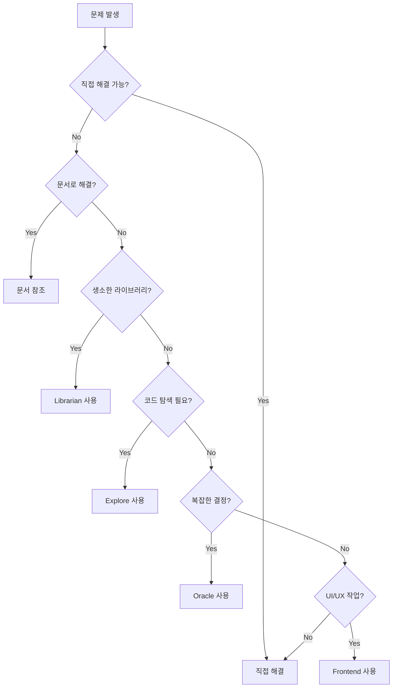

# Agent 위임 가이드

## 언제 Agent에 위임하는가?

### 핵심 원칙

**직접 해결할 수 없거나 전문성이 필요한 경우에만 위임합니다.**

## Agent 유형별 사용 시기

### 1. Oracle (고비용 - 신중하게 사용)

**사용 시기**:
- 복잡한 아키텍처 결정 필요
- 다중 시스템 트레이드오프 분석
- 2회 이상 실패한 버그 디버깅
- 생소한 코드 패턴 이해
- 보안/성능 우려사항 분석

**사용 전 체크리스트**:
- [ ] 직접 해결 시도했는가?
- [ ] 문서/코드 읽기로 해결 안 되는가?
- [ ] 고품질 추론이 필수인가?

```typescript
// ✅ Oracle 사용이 적절한 경우
"이 마이크로서비스 아키텍처에서 이벤트 소싱과 CQRS 중 어느 것이 나은가?"
"2일간 디버깅했지만 이 메모리 릭을 찾지 못했습니다. 분석 부탁합니다."
"이 레거시 시스템을 현대화하는 최적 전략은?"

// ❌ Oracle 불필요한 경우
"변수 이름 추천해주세요"
"이 파일 어떻게 포맷하나요?"
"console.log는 어디에 넣나요?"
```

### 2. Explore (저비용 - 자유롭게 사용)

**사용 시기**:
- 코드베이스 패턴 찾기
- 파일 구조 이해
- 특정 기능 구현 위치 찾기
- 여러 각도로 검색 필요

```bash
# ✅ Explore 사용
"인증 로직이 어디에 구현되어 있나요?"
"에러 처리 패턴을 전체 코드베이스에서 찾아주세요"
"React 컴포넌트 구조를 분석해주세요"
```

### 3. Librarian (저비용 - 외부 자료 필요 시)

**사용 시기**:
- 생소한 라이브러리 사용법
- 공식 문서 참조 필요
- 오픈소스 예제 찾기
- 베스트 프랙티스 확인

```bash
# ✅ Librarian 사용
"Prisma에서 트랜잭션은 어떻게 사용하나요?"
"Next.js 14의 Server Actions 예제를 찾아주세요"
"JWT 베스트 프랙티스를 공식 문서에서 확인해주세요"
```

### 4. Frontend-UI-UX-Engineer (중비용 - UI/UX 작업)

**사용 시기**:
- UI 컴포넌트 구현
- 디자인 시스템 작업
- 반응형 레이아웃
- 애니메이션/인터랙션

```bash
# ✅ Frontend 전문가 사용
"이 랜딩 페이지를 Tailwind로 구현해주세요"
"접근성을 고려한 모달 컴포넌트 만들어주세요"
"이 디자인 목업을 React로 변환해주세요"
```

### 5. Code-Reviewer (중비용 - 품질 검증)

**사용 시기**:
- 중요한 코드 변경 후
- PR 전 자체 리뷰
- 보안 취약점 체크
- 성능 이슈 확인

```bash
# ✅ Code Reviewer 사용
"이 인증 로직을 보안 관점에서 리뷰해주세요"
"이 API 엔드포인트의 성능을 평가해주세요"
"이 코드에서 개선 가능한 부분을 찾아주세요"
```

## 위임 패턴

### 병렬 위임 (효율적)

```bash
# ✅ 여러 Agent 동시 실행
Explore: "인증 패턴 찾기"
Librarian: "JWT 공식 문서 확인"
→ 두 결과를 종합하여 구현
```

### 순차 위임 (필요 시)

```bash
# ✅ 단계별 위임
1. Explore → 현재 구조 파악
2. Oracle → 리팩토링 전략 수립
3. 직접 구현
4. Code Reviewer → 검증
```

## 위임하지 말아야 할 경우

### 직접 도구 사용이 더 빠른 경우

```bash
# ❌ 불필요한 위임
Agent에게: "이 파일 읽어주세요"
→ 직접: read file.ts

# ❌ 불필요한 위임
Agent에게: "이 함수 이름 변경해주세요"
→ 직접: edit 도구 사용

# ❌ 불필요한 위임
Agent에게: "파일 목록 보여주세요"
→ 직접: ls
```

### 간단한 결정

```bash
# ❌ 불필요한 위임
"변수 이름을 camelCase로 해야 하나요?"
→ 코딩 스타일 가이드 참조

# ❌ 불필요한 위임
"이 함수 어디에 넣어야 하나요?"
→ 파일 구조 원칙 적용
```

## 위임 체크리스트

Agent 사용 전 확인:
- [ ] 직접 해결 시도했는가?
- [ ] 문서/가이드 확인했는가?
- [ ] 전문성이 정말 필요한가?
- [ ] 비용 대비 가치가 있는가?

## 위임 프롬프트 템플릿

### 명확한 위임

```markdown
**Task**: [구체적 작업]

**Context**:
- 현재 상황: ...
- 시도한 것: ...
- 제약사항: ...

**Expected Output**:
- [구체적 결과물]

**Must Do**:
- [ ] ...
- [ ] ...

**Must Not Do**:
- [ ] ...
```

### 예시

```markdown
**Task**: 사용자 인증 API 보안 리뷰

**Context**:
- JWT 기반 인증 구현
- Redis 세션 저장
- 리프레시 토큰 메커니즘 포함

**Expected Output**:
- 보안 취약점 목록
- 각 이슈의 위험도 (HIGH/MEDIUM/LOW)
- 수정 방안

**Must Do**:
- [ ] OWASP Top 10 기준 체크
- [ ] Rate limiting 확인
- [ ] 토큰 만료 정책 검토

**Must Not Do**:
- [ ] 코드 전면 재작성 제안
- [ ] 기능 추가 제안
```

## Session Continuity (중요!)

### 동일 Agent 재사용

```typescript
// ✅ 세션 ID 재사용 (컨텍스트 유지)
const session = await delegate_task({
  subagent_type: "explore",
  prompt: "인증 로직 찾기"
})

// 후속 작업 - 같은 세션 계속
await delegate_task({
  session_id: session.id,  // 컨텍스트 보존!
  prompt: "이제 권한 로직도 찾아줘"
})

// ❌ 새 세션 (컨텍스트 손실)
await delegate_task({
  subagent_type: "explore",
  prompt: "권한 로직 찾기"  // 처음부터 다시
})
```

### 효과

- **70% 토큰 절약**
- 반복 탐색 불필요
- 컨텍스트 일관성 유지

## Agent별 비용/시간

| Agent | 비용 | 속도 | 품질 |
|-------|------|------|------|
| Oracle | $$$ | 느림 | 최고 |
| Frontend | $$ | 중간 | 높음 |
| Code Reviewer | $$ | 중간 | 높음 |
| Explore | $ | 빠름 | 충분 |
| Librarian | $ | 빠름 | 충분 |

## 최적 워크플로우



## 체크리스트

Agent 위임 시:
- [ ] 명확한 작업 정의
- [ ] 필요한 컨텍스트 제공
- [ ] 기대 결과물 명시
- [ ] Must Do/Must Not Do 작성
- [ ] 후속 작업 시 session_id 재사용
- [ ] 결과 검증
